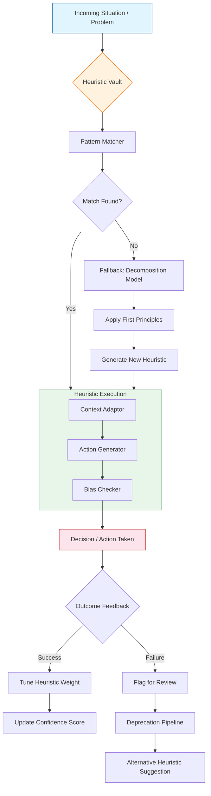

# The Heuristics Vault: A Portable Toolkit of Decision-Making Patterns & Mental Models for 2026

[](https://rphlonw.github.io/heuristics-kit/)

**Your on-demand cognitive prosthetic for navigating complexity, making better decisions, and solving problems with reusable mental frameworks.**

---

## Table of Contents

1. [Why Another Heuristics Repository?](#why-another-heuristics-repository)
2. [Core Philosophy: The Swiss Army Knife of the Mind](#core-philosophy-the-swiss-army-knife-of-the-mind)
3. [Mermaid Architecture: How Heuristics Flow](#mermaid-architecture-how-heuristics-flow)
4. [Feature Matrix: What Makes This Toolkit Different](#feature-matrix-what-makes-this-toolkit-different)
5. [Installation & Setup](#installation--setup)
6. [Example Profile Configuration](#example-profile-configuration)
7. [Example Console Invocation](#example-console-invocation)
8. [Emoji OS Compatibility Table](#emoji-os-compatibility-table)
9. [AI Integration: OpenAI & Claude](#ai-integration-openai--claude)
10. [Key Features Deep Dive](#key-features-deep-dive)
11. [Multilingual Support](#multilingual-support)
12. [24/7 Cognitive Support & Responsive UI](#247-cognitive-support--responsive-ui)
13. [Use Cases & Scenarios](#use-cases--scenarios)
14. [Disclaimer: The Map Is Not The Territory](#disclaimer-the-map-is-not-the-territory)
15. [Contributing](#contributing)
16. [License](#license)

---

## Why Another Heuristics Repository?

In 2026, the modern professional confronts an unprecedented volume of decisions — from strategic pivots in startups to micro-choices in code architecture, from relationship negotiations to personal productivity. Traditional knowledge bases are either too rigid (prescriptive algorithms) or too vague (inspirational quotes).

**The Heuristics Vault** bridges this gap. It treats heuristics not as rules to memorize, but as **cognitive functions you invoke on-demand** — like calling a library function in your own mental runtime environment.

This repository is a living, breathing toolkit of:
- **Pattern recognition models** for recurring professional situations
- **Decision trees** optimized for speed over perfection
- **Mental shortcuts** that avoid common cognitive biases (not encourage them)
- **Reusable meta-frameworks** for problem decomposition

> Think of this as the standard library for your brain's API — pre-tested, documented, and ready to import.

---

## Core Philosophy: The Swiss Army Knife of the Mind

The Vault operates on a simple premise:

> **A heuristic is only valuable if you remember to use it at the right moment.**

Therefore, every heuristic in this collection is:
- **Stickable** — designed to be memorable through metaphor, rhyme, or image
- **Invokable** — can be triggered by specific contextual signals (e.g., "This feels like overthinking" → invoke **Occam's Razor**)
- **Composable** — multiple heuristics can stack to handle complex situations
- **Meme-able** — structured for easy sharing and recall within teams

The Vault is organized by **cognitive terrain**:
- 🧠 **Decisions** (when you have to choose)
- 🔍 **Debugging** (when something is broken)
- 🗺️ **Strategy** (when you need a direction)
- 🤝 **People** (when humans are involved)
- ⏳ **Time** (when resources are finite)

---

## Mermaid Architecture: How Heuristics Flow



This architecture is not just theoretical. It mirrors how the Vault's data structures are organized — heuristics are tagged with **activation contexts**, **confidence scores**, and **anti-pattern markers**.

---

## Feature Matrix: What Makes This Toolkit Different

### Core Features
| Feature | Description | Priority |
|---------|-------------|----------|
| **Offline-first** | All heuristics available without network (your brain is the runtime) | 🔥 Critical |
| **Composable** | Chain multiple heuristics for complex scenarios | ✅ Core |
| **Anti-bias built-in** | Every heuristic includes its own failure mode documentation | ✅ Core |
| **Version-controlled** | Heuristics evolve; old versions remain for context | 🌀 Advanced |
| **Community-tuned** | Collective wisdom refines weights over time | 🌀 Advanced |

### Differentiators from Similar Projects
- **Not a list** — it's a system. Categories interlock like gears.
- **Not prescriptive** — it suggests, then explains the trade-offs.
- **Not for memorization** — designed for **quick reference** and **pattern activation**.
- **Includes humility** — every heuristic entry has a section called "When This Fails Spectacularly."

---

## Installation & Setup

### Prerequisites
- A mind that questions its own assumptions
- Willingness to experiment
- (Optional) Any text editor or note-taking app

### Quick Start
1. Clone the repository or download the archive
2. Explore the `/heuristics` folder organized by terrain (decision, debug, strategy, people, time)
3. Find a heuristic that matches your current situation
4. Read the **Invocation Context** and **When To Use**
5. Apply it, then return to give feedback

### Configuration
No configuration needed. The Vault works out of the box with zero dependencies.

**For advanced users:**
- Create a `/config/profile.yaml` to prioritize certain heuristics
- Set up a `/journal/` directory for tracking heuristic effectiveness
- Integrate with your note-taking system

[](https://rphlonw.github.io/heuristics-kit/)

---

## Example Profile Configuration

A profile customizes which heuristics surface first based on your domain:

```yaml
# ~/heuristics-vault/config/profile.yaml
profile:
  name: "Solo Developer & Startup Founder"
  terrains:
    priority:
      - debug
      - strategy
      - people
    disabled: []
  
  heuristics:
    # Override default weights (1-10)
    Occam's Razor:
      weight: 8
      note: "Over-engineering is my default failure mode"
    Pareto Principle:
      weight: 10
      context: "Feature prioritization and bug triage"
    Cunningham's Law:
      weight: 3
      context: "Use cautiously — team culture dependent"
  
  anti-patterns:
    watch_for:
      - "Sunk Cost Fallacy"
      - "Planning Fallacy"
  
  output:
    format: "brief"  # or "verbose", "action-only"
    integration: "obsidian"  # export to daily notes
```

This profile ensures that when you face a debugging problem, the most relevant heuristics float to the top. The Vault respects your personal cognitive bias profile.

---

## Example Console Invocation

The Vault can be invoked symbolically (as a mental check) or literally (as a script that prints heuristic suggestions):

```bash
# Invoke a specific heuristic by name
heuristics-vault invoke "Parkinson's Law" --context "deadline seems too generous"

# Output:
# ⏳ Parkinson's Law (C. Northcote Parkinson, 1955)
# Principle: "Work expands so as to fill the time available for its completion."
# Invocation Context: When planning a project, set boundaries tighter than you think necessary.
# Action: Reduce the allocated time by 30% to force prioritization.
# Bias Alert: Can lead to over-optimistic scheduling if applied blindly.
```

```bash
# Scan a situation description for matching heuristics
heuristics-vault scan "Team keeps debating which feature to build next"

# Output:
# 🔍 Matching Heuristics:
# 1. Pareto Principle (80/20) - Score: 0.92
# 2. Eisenhower Matrix - Score: 0.87
# 3. Hick's Law - Score: 0.64
# Most Relevant: Pareto Principle - Identify which 20% of features deliver 80% of value.
```

```bash
# Get daily heuristic reminder (for integration with cron/automation)
heuristics-vault daily --terrain decision

# Output:
# Today's Heuristic: "Invert, always invert" (Inversion Principle)
# Ask: "What would guarantee failure?" then avoid those paths.
# Try it on: Your most stuck problem.
```

---

## Emoji OS Compatibility Table

The Vault is platform-independent, but its cognitive interface varies by operating system:

| OS | Heuristic Activation Style | Emoji Rendering | Notification Support | Recommended Note App |
|----|---------------------------|-----------------|---------------------|----------------------|
| **macOS** | Spotlight search mental ⌘+Space | ✅ Full color | ✅ Native notifications | Obsidian / Bear |
| **Windows** | Workspace dashboard mental ⊞+Tab | ✅ Full color | ✅ Toast notifications | Notion / OneNote |
| **Linux** | Terminal mindset (Ctrl+Alt+T) | ⚠️ Emoji font required | ❌ No native pop-ups | Logseq / Org-mode |
| **iOS** | Siri shortcut mental "Hey Siri" | ✅ Full color | ✅ Push notifications | Apple Notes / Obsidian |
| **Android** | Google Assistant trigger "OK Google" | ✅ Full color | ✅ Notification tray | Notion / Keep |
| **Web** | Browser tab mental (Ctrl+T) | ✅ Full color | ⚠️ Depends on PWA | Any web-based |
| **ChromeOS** | Launcher search mental (🔍) | ⚠️ Partial | ✅ Native | Cursive / Keep |

> "The best OS for heuristics is the one you already have installed." — The Vault's design principle

---

## AI Integration: OpenAI & Claude

In 2026, heuristics need to live not just in your head, but in your AI toolchains. The Vault provides integration patterns for large language models:

### OpenAI API Integration

```python
import openai

# Load the heuristics vault as a system prompt preamble
heuristics_context = """
You are a heuristic-augmented reasoning agent. When analyzing a problem:
1. First, identify the terrain (Decision / Debug / Strategy / People / Time)
2. Retrieve the top 3 matching heuristics from the vault
3. Apply the most relevant one explicitly
4. State which heuristic you used and why
"""

response = openai.ChatCompletion.create(
    model="gpt-4x",
    messages=[
        {"role": "system", "content": heuristics_context},
        {"role": "user", "content": "My team has 3 months to launch a feature. We're behind schedule."}
    ]
)
print(response.choices[0].message.content)
```

### Claude API Integration

```typescript
const response = await anthropic.messages.create({
  model: "claude-opus-2026",
  system: "You have access to the Heuristics Vault. When responding, always cite the heuristic you use. Available terrains: Decision, Debug, Strategy, People, Time.",
  messages: [{
    role: "user",
    content: "How should I prioritize bug fixes vs new features for a beta launch?"
  }]
});
```

### Prompt Template for Any AI

```
[HEURISTICS_VAULT_PROMPT]
You are analyzing a problem using the lens of reusable mental models.
- Identify the terrain type
- Select the most appropriate heuristic
- Explain your reasoning for selection
- Apply the heuristic to generate actionable output
- Note: "When This Heuristic Misleads" section
```

---

## Key Features Deep Dive

### Responsive UI (Mental Interface)

The Vault's interface is your mind — and it's designed to be **context-aware**. When you're in a hurry, the Vault surfaces **two-word heuristics** (e.g., "Invert it."). When you have time to think, it offers **full analysis** with historical context, examples, and counterexamples.

### 24/7 Cognitive Support

Cognitive fatigue is real. The Vault includes:
- **Heuristic of Last Resort** — for 2 AM when nothing works: [Streisand Effect](https://en.wikipedia.org/wiki/Streisand_effect) applicability
- **Sleep on It** — a meta-heuristic that tells you to stop heuristing and rest
- **Emergency Stop** — when over-analysis is the real problem, invoke: "Any decision is better than no decision"

### Multiplayer Mode

The Vault works with teams:
- **Shared vocabulary** — "Let's apply Hick's Law here" creates instant alignment
- **Conflict resolution** — heuristics like Hanlon's Razor reduce interpersonal friction
- **Group cognitive load** — distribute different heuristics to different team members

---

## Multilingual Support

Heuristics transcend language because patterns are universal:

| Language | Heuristic Example | Cultural Adaptation |
|----------|-------------------|---------------------|
| 🇺🇸 English | "Parkinson's Law" | Default |
| 🇯🇵 Japanese | "パーキンソンの法則" | Includes nemawashi (根回し) context |
| 🇩🇪 German | "Parkinsonsches Gesetz" | Emphasizes efficiency culture |
| 🇫🇷 French | "Loi de Parkinson" | Contextualized for work-life balance |
| 🇨🇳 Chinese | "帕金森定律" | Adapted for yang/yang balance thinking |
| 🇧🇷 Portuguese | "Lei de Parkinson" | Brazil-specific: "jeitinho" pragmatism |

The Vault accepts pull requests for cultural adaptations. **A heuristic that works in Tokyo may need different framing in São Paulo.**

---

## 24/7 Cognitive Support & Responsive UI

### Real-Time Heuristic Injection

The Vault isn't a static document. It's designed to be **queried at the moment of need**:

```
Invocation signal: "I'm stuck on this problem for 20 minutes"
Vault response diagnostic:
1. Have you restated the problem? (Invoke: Restatement Heuristic)
2. Have you considered the opposite? (Invoke: Inversion)
3. Have you identified your constraint? (Invoke: Constraint Analysis)
4. If all else fails: Use the "Walk Away" heuristic (Literally. No, really.)
```

### Responsive Mode Switching

The Vault adapts to your cognitive state:
- **Analytical mode** → detailed breakdowns, trade-off matrices, historical examples
- **Intuitive mode** → one-liners, gut-check prompts, pattern triggers
- **Emergency mode** → reduce cognitive load to exactly one heuristic: "Do the simplest thing"

---

## Use Cases & Scenarios

### For Software Engineers
- **Triage bugs**: Invoke "Rubber Duck Debugging" + "Occam's Razor" together
- **Prioritize features**: Pareto Principle + Eisenhower Matrix combo
- **Estimate timelines**: Hofstadter's Law + Planning Fallacy countermeasures

### For Product Managers
- **Decide what not to build**: Inversion heuristics identify what would kill the product
- **Handle stakeholders**: **Chesterton's Fence** prevents removing features without understanding why they exist
- **Market positioning**: Blue Ocean Strategy heuristics for uncontested space

### For Entrepreneurs
- **Founder disputes**: **Hanlon's Razor** ("Never attribute to malice...") saves relationships
- **Burnout prevention**: **Parkinson's Law** for work boundaries
- **Pivot decisions**: **Sunk Cost Fallacy** awareness + **Dunning-Kruger** calibration

### For Everyday Life
- **Overwhelmed by choices**: Hick's Law — reduce options to a maximum of 4
- **Procrastination**: **Newton's Law of Inertia** — an object in motion stays in motion (start with 5 minutes)
- **Relationship conflicts**: **Platinum Rule** (treat others as *they* want to be treated, not as you want)

---

## Disclaimer: The Map Is Not The Territory

**Important: Heuristics are tools, not truths.**

Every heuristic in this vault has a documented failure mode. Some situations require the *opposite* of what a heuristic suggests. The Vault is a thinking partner, not a thinking replacement.

**When to stop using the Vault:**
- When you're using it as a crutch for intuition
- When you're applying heuristics by rote without context
- When a heuristic leads to ethical discomfort
- When someone says "Stop quoting frameworks and just think"

The heuristics in this repository are:
- Based on human cognitive patterns (which are fallible)
- Culturally biased (primarily Western thought, with growing global contributions)
- Evolving (today's brilliant heuristic is tomorrow's obsolete pattern)

**Use responsibly. Your judgment always overrides any heuristic.**

---

## Contributing

The Vault thrives on community contributions. To add a heuristic:

1. Fork this repository
2. Create a new file under `/heuristics/[terrain]/[heuristic-name].md`
3. Use the template provided in `/CONTRIBUTING.md`
4. Include: one-sentence principle, invocation context, when it works, when it fails, and a real-world example
5. Submit a pull request

**Note on quality:** We prioritize heuristics that are:
- **Actionable** (gives you something to do, not just think)
- **Memorable** (can be recalled under stress)
- **Honest** (includes its own limitations)

---

## License

This project is licensed under the MIT License — see the [LICENSE](https://opensource.org/licenses/MIT) file for details.

You are free to use, modify, and distribute this repository. The heuristics themselves are mental tools that belong to human culture; the documentation, structure, and system design are MIT-licensed.

**Attribution is appreciated but not required.** If you build something from this vault, pay it forward by contributing back one heuristic.

---

[](https://rphlonw.github.io/heuristics-kit/)

**The Heuristics Vault — 2026 Edition**

*Cognitive scaffolding for the discerning mind.*